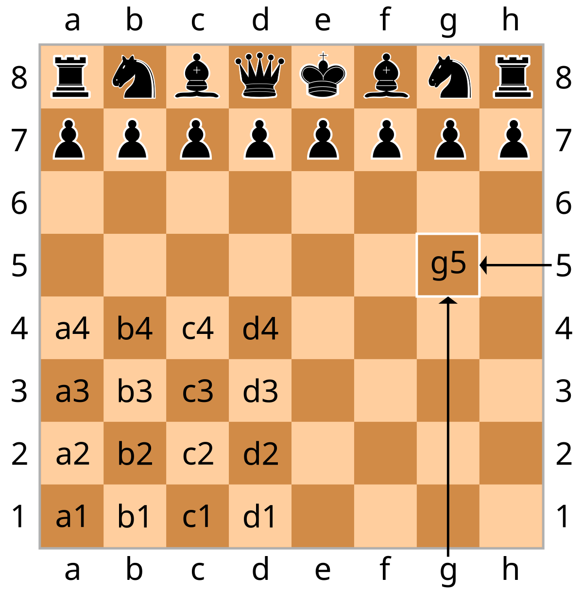

# Chessboard

Track the state of a chessboard in a terminal using Unicode with a video live stream from a phone.

## Goals

1. Explore Google's Live API.
2. Track the board state of a chess game.
3. Use a phone camera to capture the game. Images at first, then live video.
4. Test bandwidth and latency of the phone camera.
5. Test costs of using the Live API and streaming video.
6. Explore efficiency options: segment video locally and extract only relevant frames.
7. Explore voice generation in broadcast.
   See [NEXT ping pong demo](https://github.com/GoogleCloudDevRel/next25-retro-ping-pong)

## Architecture

(This is just a guess) A phone app will send pictures a GCP bucket, or livestream video to (??). That bucket/video is
processed by Gemini. Gemini will identify what two board locations changed: where the piece moved from and to.
Programmatically determine the state of the board off of the changes observed to track what pieces are where.

## Installation

1. Clone the repository:
   ```
   git clone https://github.com/mattporemba/multimodal-demo.git
   cd multimodal-demo
   ```

2. Install the package:
   ```
   pip install -e .
   ```

## Usage

### Running from the command line

After installation, you can run the application using the provided console script:

```
chessboard
```

### Running the main function directly

You can also run the main function directly without installation:

```
python main.py
```

This will display a standard 8x8 chessboard in the terminal with chess pieces in their starting positions.

### Controlling the Chessboard

Once the chessboard is displayed, you can move pieces by entering commands in the format:

```
<from_position> <to_position>
```

For example:
- To move a pawn from a2 to a4, enter: `a2 a4`
- To move a knight from b1 to c3, enter: `b1 c3`

The positions use standard chess notation (algebraic notation):
- Columns are labeled a through h (from left to right)
- Rows are numbered 1 through 8 (from bottom to top)



In algebraic notation:
1. Each square has a unique coordinate combining a letter (a-h) and a number (1-8)
2. White pieces start on rows 1-2, black pieces on rows 7-8
3. To move a piece, simply specify the starting square followed by the destination square
4. For example, moving from e2 to e4 would be entered as: `e2 e4`

To exit the application, type `quit`.

### Using as a module

You can also use the package in your own Python code:

```python
from chessboard.chessboard import generate_chessboard, display_chessboard

# Generate a standard 8x8 chessboard
board = generate_chessboard()

# Generate a custom-sized chessboard (e.g., 4x4)
small_board = generate_chessboard(4)

# Display a chessboard
display_chessboard(board)
```

## Running Tests

To run the tests, use pytest:

```
pytest
```

## Project Structure

```
chessboard/
├── chessboard/
│   ├── __init__.py
│   ├── chessboard.py
│   ├── chess_piece.py
│   └── game_controller.py
├── tests/
│   ├── __init__.py
│   ├── test_chessboard.py
│   ├── test_chess_piece.py
│   └── test_game_controller.py
├── main.py
├── setup.py
└── requirements.txt
```
